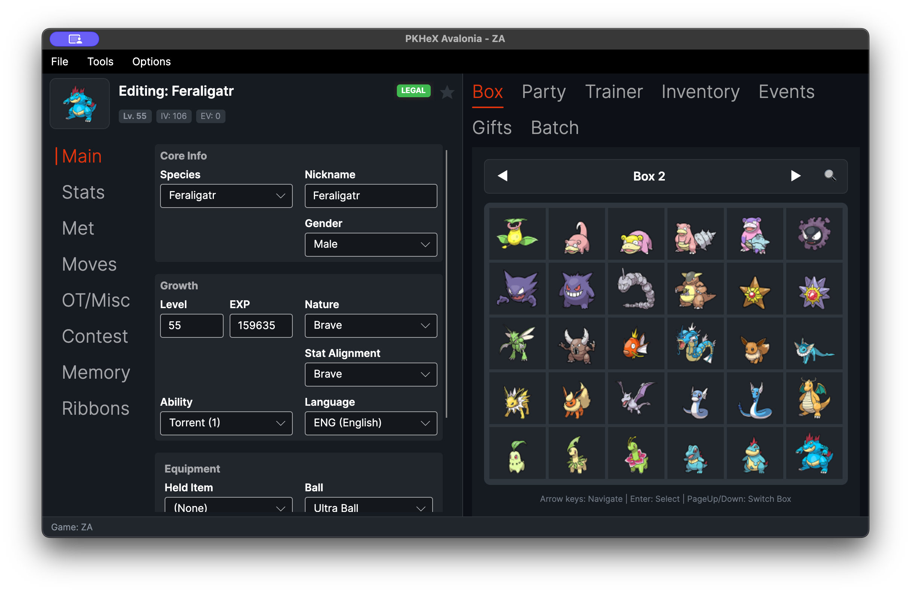
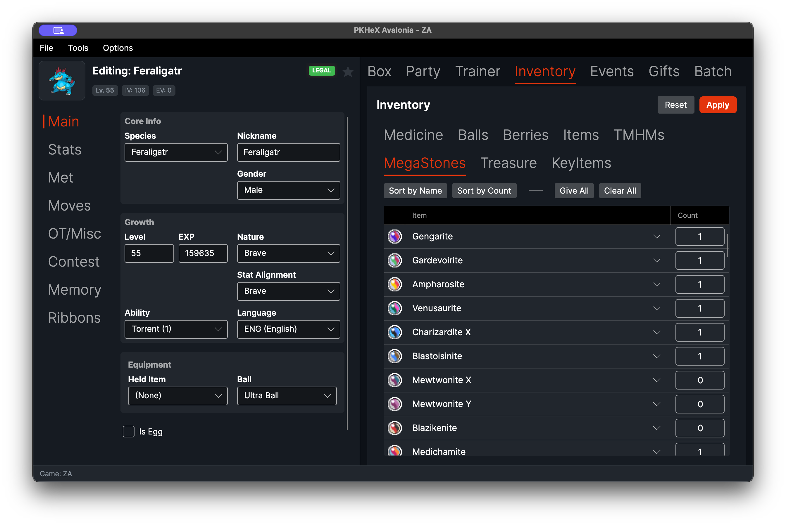
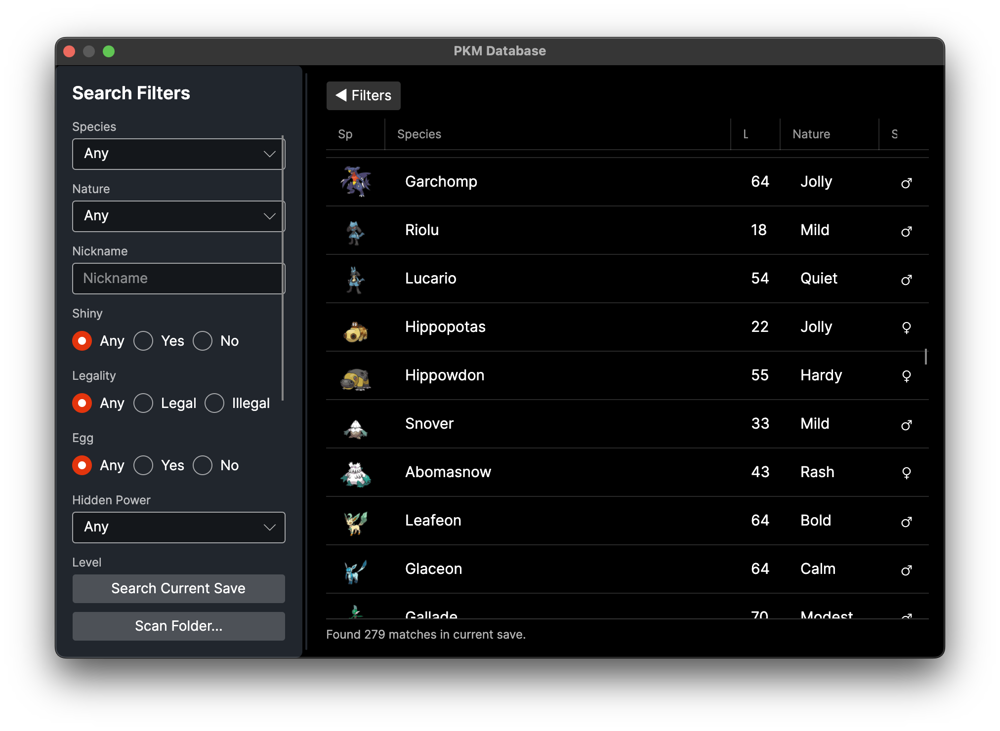
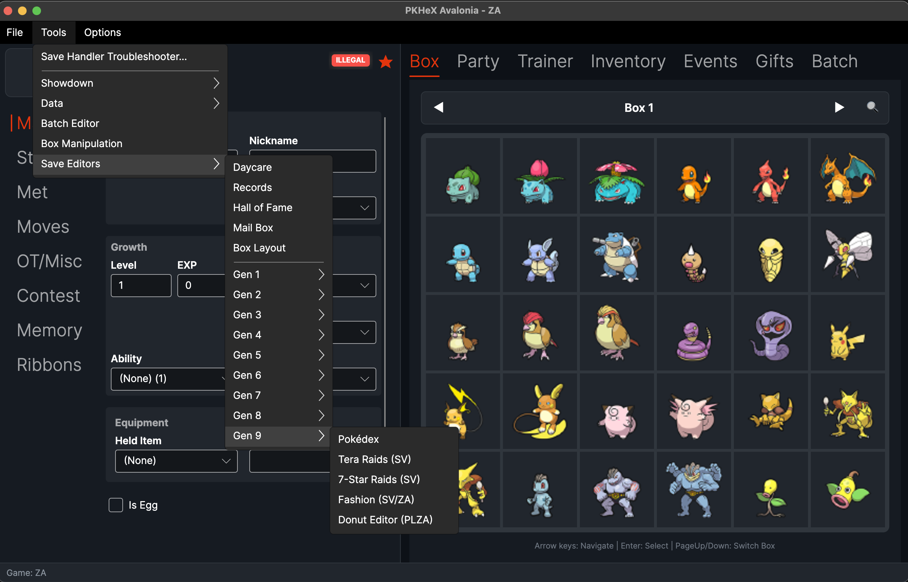

# PKHeX Avalonia


PKHeX Avalonia is a cross-platform port of [PKHeX](https://github.com/kwsch/PKHeX). It's the classic Pokémon save editor, built with Avalonia so it runs on **Windows**, **macOS**, and **Linux**.


## Download

Get the latest build for your platform from the [Releases](https://github.com/realgarit/PKHeX-Avalonia/releases/latest) page:

| Platform | File |
|----------|------|
| Windows (x64) | `PKHeX-Avalonia-win-x64.zip`, or the `PKHeX-Avalonia-Setup.exe` installer |
| Linux (x64) | `PKHeX-Avalonia-linux-x64.zip`, or `PKHeX-Avalonia-linux-x64.AppImage` |
| macOS Apple Silicon | `PKHeX-Avalonia-osx-arm64.zip`, or `PKHeX-Avalonia-osx-arm64.dmg` |
| macOS Intel | `PKHeX-Avalonia-osx-x64.zip`, or `PKHeX-Avalonia-osx-x64.dmg` |

Every build is self-contained, so you don't need to install .NET.

**Signing note:** the installer/dmg builds are code-signed and (on macOS)
notarized only once the repo owner has configured signing secrets — see
[`docs/packaging.md`](docs/packaging.md). Until then, filenames ending in
`-unsigned` (e.g. `PKHeX-Avalonia-Setup-unsigned.exe`,
`PKHeX-Avalonia-osx-arm64-unsigned.dmg`) mean the OS will still warn on
first launch:
- **Windows:** SmartScreen "unknown publisher" — click **More info** then
  **Run anyway**.
- **macOS:** right-click the app, pick **Open**, then click **Open** in the
  dialog (or run `xattr -d com.apple.quarantine
  ~/Downloads/PKHeX.Avalonia.app`).

Package-manager installs (Homebrew cask, winget) are templated under
`packaging/` and documented in `docs/packaging.md`, pending signed release
builds to submit.


## Project Structure

The code is split into layers so the UI stays separate from the PKHeX logic:

| Project | What it does | Uses |
|---------|--------------|------|
| **PKHeX.Core** | Save, entity, and legality logic. Kept 1:1 with [upstream PKHeX](https://github.com/kwsch/PKHeX). We don't change it directly. | None |
| **PKHeX.Application** | Use-cases and service interfaces on top of Core. | Core |
| **PKHeX.Infrastructure** | File access and other OS bits. | Application, Core |
| **PKHeX.Presentation** | View-models. No UI framework here. | Application, Core |
| **PKHeX.Avalonia** | The Avalonia UI: views, styles, and the desktop app. | all of the above |

Tests live under `Tests/`: `PKHeX.Core.Tests`, `PKHeX.Avalonia.Tests`, and `PKHeX.Architecture.Tests` (which checks the layers above stay separate).

## Features

* Edit saves from Gen 1 to Gen 9, plus Let's Go, Legends: Arceus, BDSP, and Legends: Z-A.
* Edit any Pokémon: stats, moves, ribbons, memories, and more.
* Checks legality as you go and can fix illegal Pokémon for you.
* Import and export Pokémon files and Showdown sets.
* Move Pokémon between generations. It converts the format for you.
* Search your boxes with the PKM, Mystery Gift, and Encounter databases.
* Edit many Pokémon at once with the batch editor.
* Game specific editors under Tools, like Pokédex, Hall of Fame, and Secret Base.
* Drag and drop with the OS: drag a box/party slot out to Finder/Explorer to get an entity file, drop entity files onto a slot (or several onto a box to fill it), and drop a save file anywhere on the window to open it.

### OS drag-and-drop notes

* **Drag out (box/party slot → desktop)** writes a decrypted entity file (e.g. `.pk9`) to a temp
  location and hands the OS a real file reference via Avalonia's `IStorageProvider`. This is a
  desktop-backed capability: it works on Windows, macOS, and Linux (X11 and Wayland) when running
  as a normal desktop app. If a future Avalonia backend can't resolve a real file path for the
  temp file (e.g. a sandboxed or browser-hosted build), drag-out degrades gracefully to in-app-only
  dragging (box ↔ party still works) instead of failing.
* **Drag in** accepts `.pk1`–`.pk9`, `.pb7`/`.pb8`, `.pa8`, encrypted `.ek*`, and Mystery Gift files,
  reusing the same detection/conversion/legality pipeline as the existing folder import feature.
  Incompatible or unreadable files are rejected with a message dialog rather than crashing or
  silently corrupting a slot.
* **Drag a save file** onto any part of the main window (a slot, the editor panel, or elsewhere)
  to open it, the same as File > Open.


## Building from Source

### Requirements
* [.NET 10 SDK](https://dotnet.microsoft.com/download/dotnet/10.0)

### Run
```bash
dotnet run --project PKHeX.Avalonia
```

### Build
```bash
dotnet build PKHeX.sln -c Release
```

### Test
```bash
dotnet test PKHeX.sln
```

### Publish (example: macOS ARM)
```bash
dotnet publish PKHeX.Avalonia -c Release -r osx-arm64 --self-contained -p:PublishSingleFile=true
```

## Screenshots

Pokémon editor and box view. The full editor next to the sprite box grid.

Inventory editor. Edit items by pouch (Medicine, Balls, Berries, Mega Stones, and so on).

PKM Database. Search your boxes with a filter rail you can resize or hide.

Save editors. Gen 1 to 9 plus game specific tools under Tools, then Save Editors.


## Credits
This fork is built on the work of the [PKHeX team](https://github.com/kwsch/PKHeX).

* **Logic & Research:** [PKHeX](https://github.com/kwsch/PKHeX)
* **QR Codes:** [QRCoder](https://github.com/codebude/QRCoder) (MIT)
* **Sprites:** [pokesprite](https://github.com/msikma/pokesprite) (MIT)
* **Arceus Sprites:** National Pokédex Icon Dex project and contributors.
